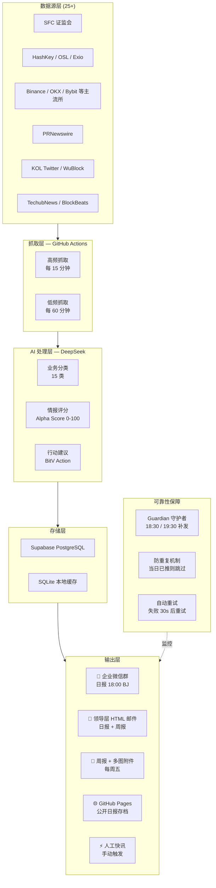

# Web3Watch HK — 香港 Web3 行业情报系统

[](https://nodejs.org)
[](https://supabase.com)
[](https://deepseek.com)
[](/.github/workflows)
[](LICENSE)

> 全自动香港 Web3 行业情报聚合与分析系统。7×24h 监控 25+ 数据源，DeepSeek AI 实时分类评分，每日 18:00 自动推送企业微信群与领导层邮件。

**[📊 Live Dashboard →](https://web3watchhk.vercel.app)** · **[📄 Daily Archive →](https://beltran12138.github.io/Web3Watch-HK)**

---

## 系统架构



---

## 核心指标

| 指标 | 数值 |
|------|------|
| 监控数据源 | **25+** 个（媒体、交易所、监管机构、KOL） |
| 抓取频率 | 每 **15** 分钟一次（高频源） |
| 日均处理 | **300+** 条资讯 |
| AI 精选输出 | 每日精华 **10** 条，推送给决策层 |
| 送达人数 | **5** 位核心领导层（CEO / CTO / 产品负责人） |
| 日报到达率 | **99%+**（Guardian 双重保障） |
| 平均延迟 | 新闻发布到企微推送 **<20 分钟** |
| 数据库行数 | **10,000+** 条情报，持续累积 |

---

## 功能特性

### 智能情报处理
- **Alpha Score 评分**：0-100 分情报价值评分体系（DeepSeek AI）
  - 90-100：SFC 政策突变、牌照获批撤回、高管变动
  - 70-89：HK 市场重要进展、RWA / 稳定币新规
  - 40-69：常规业务动态
- **15 类业务分类**：合规、RWA、稳定币、投融资、交易/量化/AI 等
- **竞品矩阵分析**：港所（HashKey/OSL/Exio）vs 离岸所（Binance/OKX/Bybit）
- **长期记忆系统**：趋势提炼存入 `insights` 表，AI 分析时自动引用历史趋势

### 多渠道输出
- **企业微信**：Markdown 卡片，宏观盘面 + AI 摘要，≤4096 字符
- **HTML 邮件**：响应式设计，多图内嵌（CID），支持按序排列多张图片
- **人工快讯**：GitHub Actions 表单触发，AI 自动补全详情 / 评分 / 建议
- **GitHub Pages**：每日自动发布静态日报存档

### 系统可靠性设计
- **Guardian 工作流**：18:30、19:30 两次检查，日报未推则自动补发
- **防重复推送**：触发前查询当日 Actions 历史，已成功则跳过
- **Concurrency 控制**：`cancel-in-progress: false` + 幂等性检查双重保障
- **自动重试**：失败后 30 秒重试一次
- **文件新鲜度检查**：48 小时内未更新的图片拒绝发送，防止残留文件误发

---

## 数据源覆盖

| 类别 | 数据源 |
|------|--------|
| 🏛️ 香港监管 | SFC（证监会官网）|
| 🏦 港所 | HashKey Exchange、HashKey Group、OSL、Exio、TechubNews |
| 🌐 头部离岸所 | Binance、OKX、Bybit、Gate、MEXC、Bitget、HTX、KuCoin |
| 📰 加密媒体 | WuBlock、TechFlow、BlockBeats、PANews |
| 📡 新闻稿 | PRNewswire（HK / Exchange 白名单过滤）|
| 🐦 KOL | WuShuo、Phyrex、TwitterAB、XieJiayin、JustinSun |

---

## 技术栈

| 层级 | 技术 |
|------|------|
| 运行时 | Node.js 22 + Express 5 |
| 数据库 | Supabase (PostgreSQL) + better-sqlite3（本地缓存）|
| AI | DeepSeek API（分类 / 评分 / 摘要 / 趋势提炼）|
| 爬虫 | Puppeteer + Cheerio + Axios |
| 邮件 | Nodemailer（SMTP，CID 内嵌图片）|
| CI/CD | GitHub Actions（9 个工作流）|
| 静态站 | 纯 HTML/CSS（GitHub Pages 自动发布）|
| 监控 | 自定义 AlertManager + 数据质量检查器 |

---

## 工作流总览

| 工作流 | 触发方式 | 功能 |
|--------|---------|------|
| `scrape.yml` | 每 60 分钟 | 全量数据源抓取 |
| `scrape_high.yml` | 每 15 分钟 | 高频核心源抓取 |
| `daily_report.yml` | 每天 18:00 BJ | 日报生成 + 推送 + Pages 更新 |
| `report_guardian.yml` | 18:30 / 19:30 BJ | 日报补发守护者 |
| `weekly_report.yml` | 每周五 18:00 BJ | 周报生成 + 企微推送 |
| `send_weekly_email.yml` | 手动触发 | 领导层周报邮件（含图片）|
| `manual_push.yml` | 手动触发 | 人工快讯（AI 补全 + 推送）|
| `sync_wiki.yml` | 手动触发 | 行研知识库同步 |
| `cron.yml` | 定时 | 数据清理 |

---

## 本地运行

```bash
git clone https://github.com/Beltran12138/Web3Watch-HK.git
cd Web3Watch-HK
npm install
cp .env.example .env   # 填入各 API Key

# 干运行（只生成日报内容，不推送）
npm run daily-report:dry

# 启动 API 服务
npm start
```

### 环境变量

| 变量 | 说明 | 必填 |
|------|------|------|
| `SUPABASE_URL` | Supabase 项目 URL | ✅ |
| `SUPABASE_KEY` | Supabase anon key | ✅ |
| `DEEPSEEK_API_KEY` | DeepSeek API Key | ✅ |
| `WECOM_WEBHOOK_URL` | 企业微信机器人 Webhook | ✅ |
| `SMTP_HOST` | SMTP 服务器 | 邮件功能 |
| `SMTP_USER` | 发件人邮箱 | 邮件功能 |
| `SMTP_PASS` | 邮箱授权码 | 邮件功能 |
| `WEEKLY_EMAIL_TO` | 周报收件人列表（逗号分隔）| 邮件功能 |

---

## 项目结构

```
Web3Watch-HK/
├── .github/workflows/     # 9 个 GitHub Actions 工作流
├── scrapers/              # 各数据源爬虫（Puppeteer + Axios）
├── monitoring/            # AlertManager + 数据质量检查
├── integrations/          # Notion / GitHub 集成
├── mcp-server/            # Model Context Protocol 服务
├── docs/                  # GitHub Pages 静态日报存档（自动生成）
├── weekly/                # 周报图片上传目录
├── report.js              # 日报 / 周报核心生成逻辑
├── ai.js                  # DeepSeek AI 集成
├── ai-enhanced.js         # AI 增强处理（多提供商降级）
├── ai-optimizer.js        # AI 成本优化器（批量 + 规则引擎）
├── email-report.js        # HTML 邮件构建 + 发送
├── push-channel.js        # 多渠道推送统一入口
├── wecom.js               # 企业微信 Webhook 推送
├── macro-market.js        # 宏观市场数据面板
├── wiki-context.js        # 行研知识库上下文注入
└── generate-pages.js      # GitHub Pages 静态页生成
```

---

## 设计亮点

**Alpha Score 情报评分体系**
自研 0-100 分情报价值模型，替代人工筛选。评分基于香港合规所视角，高分条目自动触发企微实时推送。

**长期记忆 + 趋势引用**
周报提炼行业长期趋势存入 `insights` 表。后续 AI 分析自动注入历史趋势，实现"越用越聪明"的情报积累。

**成本优化**
`ai-optimizer.js` 批量调用 + 规则引擎优先匹配，不符阈值条目跳过 AI，节省约 40% Token 消耗。

**系统韧性**
Guardian 双保险 + 幂等防重 + 自动重试 + 新鲜度校验，确保 7×24h 无监守运行。

---

*Built with ❤️ for Hong Kong Web3 industry intelligence*
