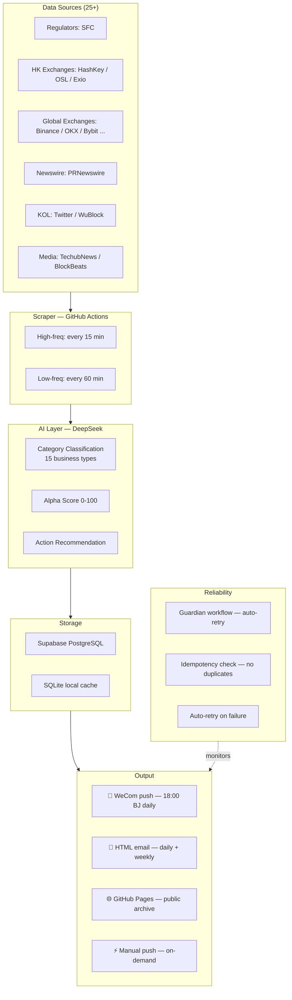

# 🔭 Web3Watch HK

**An automated AI-powered industry intelligence system** — monitors 25+ news sources 24/7, scores each article with DeepSeek AI, and delivers curated daily/weekly digests to WeCom and email. Built for the Hong Kong Web3 market, adaptable to any niche.

[](https://nodejs.org)
[](https://supabase.com)
[](https://deepseek.com)
[](/.github/workflows)
[](LICENSE)

**[📊 Live Dashboard →](https://alpha-radar-eight.vercel.app)** · **[📄 Daily Archive →](https://beltran12138.github.io/Web3Watch-HK)** · **[⭐ Star History](#star-history)**

[](https://vercel.com/new/clone?repository-url=https://github.com/Beltran12138/Web3Watch-HK&root-directory=dashboard&env=NEXT_PUBLIC_SUPABASE_URL,NEXT_PUBLIC_SUPABASE_ANON_KEY&envDescription=Your%20Supabase%20project%20URL%20and%20anon%20key)

---

## What It Does

| Step | What happens |
|------|-------------|
| **Scrape** | GitHub Actions cron fetches 25+ sources every 15 min (exchanges, regulators, media, KOLs) |
| **Score** | DeepSeek AI classifies each article into 15 business categories and assigns an **Alpha Score** (0-100) |
| **Filter** | Only high-value articles (score ≥ threshold) trigger real-time WeCom push |
| **Report** | Daily digest at 18:00 BJ → WeCom group. Weekly digest → HTML email with inline images |
| **Publish** | GitHub Pages auto-publishes a public daily archive after each report |

---

## Live Demo

> **Dashboard**: [alpha-radar-eight.vercel.app](https://alpha-radar-eight.vercel.app)
> — Browse today's intelligence, 30-day archive, source health, and analytics charts.

> **Daily Archive**: [beltran12138.github.io/Web3Watch-HK](https://beltran12138.github.io/Web3Watch-HK)
> — Auto-updated static HTML after each daily report.

---

## Architecture



---

## Key Metrics

| Metric | Value |
|--------|-------|
| Data sources monitored | **25+** (regulators, exchanges, media, KOLs) |
| Scrape frequency | Every **15 minutes** (high-priority sources) |
| Articles processed daily | **300+** |
| AI-curated highlights | Top **10** delivered to decision-makers |
| Report delivery rate | **99%+** (Guardian workflow ensures delivery) |
| Avg. latency | News published → WeCom push **< 20 min** |
| DB records accumulated | **10,000+** intelligence entries |

---

## Features

### 🤖 AI Intelligence Scoring
- **Alpha Score (0-100)**: Proprietary signal strength score powered by DeepSeek
  - `90-100` Regulatory shock events (SFC policy changes, license revocations)
  - `75-89` Major HK market developments (RWA/stablecoin regulation, strategic moves)
  - `40-74` Routine business updates
- **15 business categories**: Compliance, RWA, Stablecoins, VC/Funding, Quant/AI, Payments...
- **Long-term memory**: Weekly insights extracted and stored; future AI calls reference past trends

### 📡 Multi-channel Delivery
- **WeCom (企业微信)**: Real-time Markdown cards for breaking news; daily digest at 18:00 BJ
- **HTML email**: Responsive template, multiple inline images, leadership-ready weekly reports
- **Manual push**: GitHub Actions form → AI auto-fills detail/score/recommendation → instant push
- **GitHub Pages**: Static daily archive auto-published after each report run

### 🛡️ Reliability Engineering
- **Guardian workflow**: Checks at 18:30 & 19:30 BJ — triggers report if daily run missed
- **Idempotency**: Pre-checks GitHub Actions history to prevent duplicate pushes
- **Auto-retry**: Re-runs failed report after 30-second wait
- **File freshness check**: Rejects stale files (>48h) to prevent accidental re-sends

---

## Tech Stack

| Layer | Technology |
|-------|-----------|
| Runtime | Node.js 22 + Express 5 |
| Database | Supabase (PostgreSQL) + better-sqlite3 |
| AI | DeepSeek API (classification, scoring, summarization) |
| Scraper | Puppeteer + Cheerio + Axios |
| Email | Nodemailer (SMTP, CID inline images) |
| CI/CD | GitHub Actions (9 workflows) |
| Dashboard | Next.js 15 App Router + Tailwind + Recharts |
| Static site | Pure HTML/CSS → GitHub Pages |

---

## Workflows

| Workflow | Trigger | Function |
|----------|---------|----------|
| `scrape_high.yml` | Every 15 min | High-priority source scraping |
| `scrape.yml` | Every 60 min | Full source scraping |
| `daily_report.yml` | Daily 18:00 BJ | Report generation + push + Pages update |
| `report_guardian.yml` | 18:30 & 19:30 BJ | Delivery guardian / auto-retry |
| `weekly_report.yml` | Friday 18:00 BJ | Weekly digest → WeCom |
| `send_weekly_email.yml` | Manual | Weekly HTML email with images |
| `manual_push.yml` | Manual | On-demand news push (AI-enhanced) |
| `sync_wiki.yml` | Manual | Research knowledge base sync |
| `cron.yml` | Scheduled | Data lifecycle cleanup |

---

## Quick Start

### Prerequisites
- Node.js 22+
- Supabase project (free tier works)
- DeepSeek API key
- WeCom bot webhook URL

### Setup

```bash
git clone https://github.com/Beltran12138/Web3Watch-HK.git
cd Web3Watch-HK

npm install

cp .env.example .env
# Edit .env with your credentials

# Dry run — generate report without sending
npm run daily-report:dry

# Start API server
npm start
```

### Environment Variables

```bash
# Required
SUPABASE_URL=https://xxxx.supabase.co
SUPABASE_KEY=your_supabase_anon_key
DEEPSEEK_API_KEY=your_deepseek_api_key
WECOM_WEBHOOK_URL=https://qyapi.weixin.qq.com/cgi-bin/webhook/send?key=xxx

# Email (optional)
SMTP_HOST=smtp.exmail.qq.com
SMTP_PORT=465
SMTP_USER=sender@yourcompany.com
SMTP_PASS=your_smtp_password
WEEKLY_EMAIL_TO=boss@company.com,cto@company.com

# Dashboard (Vercel env vars)
NEXT_PUBLIC_SUPABASE_URL=https://xxxx.supabase.co
NEXT_PUBLIC_SUPABASE_ANON_KEY=eyJhbGci...
```

### Deploy Dashboard

[](https://vercel.com/new/clone?repository-url=https://github.com/Beltran12138/Web3Watch-HK&root-directory=dashboard&env=NEXT_PUBLIC_SUPABASE_URL,NEXT_PUBLIC_SUPABASE_ANON_KEY&envDescription=Your%20Supabase%20credentials)

Set `dashboard/` as the root directory in Vercel, add your Supabase env vars, and deploy.

---

## Project Structure

```
Web3Watch-HK/
├── .github/workflows/     # 9 GitHub Actions workflows
├── scrapers/              # Source scrapers (Puppeteer + Axios)
├── monitoring/            # AlertManager + data quality checker
├── dashboard/             # Next.js 15 dashboard (Vercel)
│   ├── app/               # App Router pages
│   └── components/        # NewsCard, Charts, Nav
├── docs/                  # GitHub Pages static archive (auto-generated)
├── weekly/                # Weekly report image upload directory
├── report.js              # Daily/weekly report generation core
├── ai.js                  # DeepSeek AI integration
├── ai-optimizer.js        # Batch processing + cost optimization
├── email-report.js        # HTML email builder + sender
├── generate-pages.js      # GitHub Pages static site generator
└── wecom.js               # WeCom webhook push
```

---

## Design Highlights

**Self-reinforcing intelligence loop**
Each week's report extracts 1-3 long-term industry trends into an `insights` table. Future AI calls automatically inject these trends as context — the system gets smarter the longer it runs.

**Cost-optimized AI pipeline**
`ai-optimizer.js` batches AI calls and applies rule-based pre-filtering. Articles below the relevance threshold skip the AI entirely, cutting token spend by ~40%.

**Production-grade reliability without a server**
The entire pipeline runs on GitHub Actions — no server to maintain. Guardian workflow + idempotency checks + auto-retry achieve 99%+ delivery rate with zero ops overhead.

---

## 中文说明

> 本项目是一个面向香港 Web3 市场的**全自动行业情报系统**，监控 25+ 数据源（SFC 证监会、HashKey、OSL、Binance、OKX 等），DeepSeek AI 实时评分分类，每日 18:00 推送企微日报，每周五发送领导层邮件周报。系统基于 GitHub Actions 全托管运行，零服务器维护成本。

---

## Star History

[](https://star-history.com/#Beltran12138/Web3Watch-HK&Date)

---

## Contributing

Issues and PRs welcome. If you adapt this for a different industry (fintech, crypto, AI, biotech), share your fork — happy to link it here.

---

*Built with Node.js + DeepSeek AI + GitHub Actions · Hong Kong Web3 industry intelligence*
